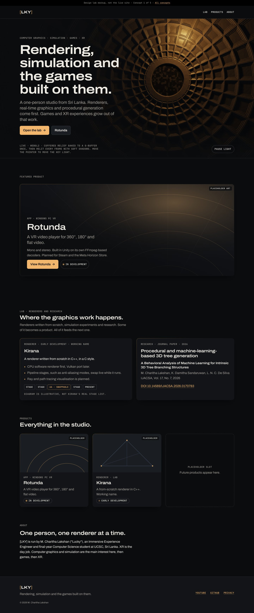
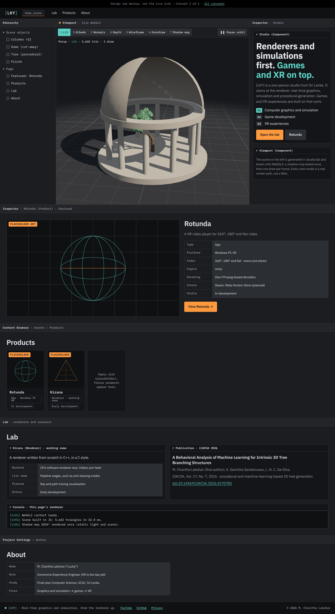
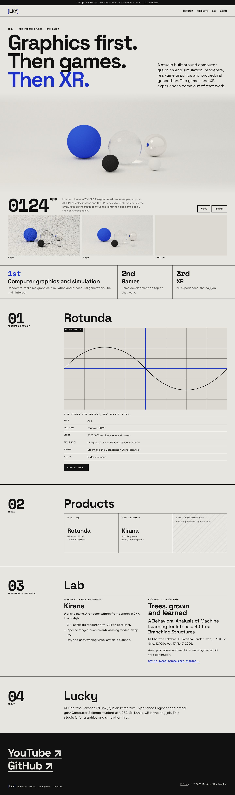
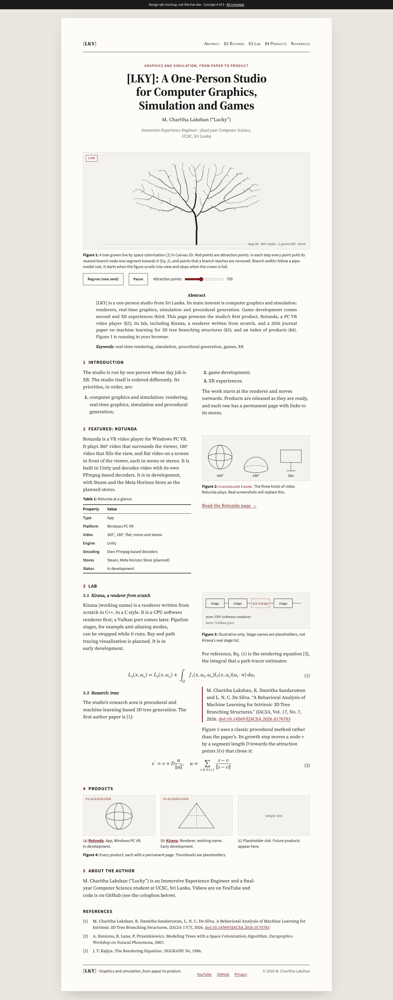
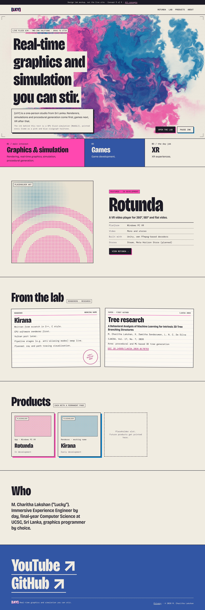

# Graphics-first home page concepts

_Design exploration, 2026-10-08. Concepts only: nothing here is applied to the site yet._

**Why.** The current Key Light design reads as an XR studio. The studio's priorities are, in order: (1) computer graphics and simulation, (2) game development, (3) XR. The site should feel like it was made by someone who writes renderers and simulations.

**Where.** Mockups: `public/design-lab/` (gallery `index.html`, `concept-1.html` … `concept-5.html`). After merge and once Pages is enabled: <https://charithalakshan.github.io/studio-site/design-lab/>. Every page has `<meta name="robots" content="noindex">`, and none is in the sitemap. Screenshots (1440 px desktop and 390 px mobile, full page): `screenshots/`.

**Content rules followed.** Only the facts given in the brief for this session. Kirana and the paper are mock content for this exploration. All product art is placeholder and labelled as such. The mockups hard-code brand values because they are self-contained throwaway files (logged in Decisions.md).

**Shared behaviour of every real-time element** (all verified in headless Chromium):

- Vanilla WebGL2 or Canvas 2D, inline, no libraries.
- Static fallback frame when WebGL2 (or float render targets) is missing (`html.no-gl`).
- `prefers-reduced-motion: reduce`: one still frame, zero `requestAnimationFrame` calls afterwards.
- Pauses when the tab is hidden or the canvas is off-screen (measured: 0 frames per second when scrolled away).
- Device pixel ratio capped at 2, plus a per-concept pixel budget.
- A visible Pause button on every animated hero (WCAG 2.2.2).
- Backtick (`` ` ``) toggles a frame-time overlay.

**Performance numbers.** This environment has only a software GPU (SwiftShader), so the costs below are analytic (passes, pixels, work per pixel), not measured frame times. On a real device, the backtick overlay shows them.

| # | Name | Look | Real-time element | Tagline proposal | Effort |
|---|---|---|---|---|---|
| 1 | Key Light, Relit | Dark, cinematic, warm key light | WebGL2 deferred relighting of a procedural coffered dome | Rendering, simulation and the games built on them. | **S** |
| 2 | Viewport | Engine editor, graphite UI | WebGL2 rasterizer with 7 real debug view modes | Real-time graphics and simulation, from the renderer up. | **L** |
| 3 | Converge | High-key Swiss, ultramarine | WebGL2 progressive path tracer that sleeps when converged | Graphics first. Then games. Then XR. | **M** |
| 4 | Proceedings | A graphics paper, serif, oxblood | Canvas 2D space-colonization tree as Figure 1 | Graphics and simulation, from paper to product. | **M** |
| 5 | Stir | Risograph zine, pink and blue ink | WebGL2 stable-fluids sim printed as a two-ink halftone | Real-time graphics and simulation you can stir. | **M** |

---

## 1 · Key Light, Relit

**Idea.** The current design, re-angled. The decorative "light pool" becomes a real light: a coffered dome relief (log-polar coffers around an oculus, a nod to Rotunda's name) is lit live by the brand's key light. The light follows the pointer and orbits on its own when idle. Copy, nav order and a new Lab section move graphics to the front.

**Palette.** Unchanged from `tokens.css`: void `#0b0c0e`, surface `#121418`, raised `#1a1d22`, line `#2a2e35`, line-strong `#3a3f48`, text `#edeae4` (16.3:1), muted `#a39f98` (7.4:1), key `#f2b66d` (10.9:1), fill `#4a5d7a` (decorative).

**Type.** Archivo (variable width, 118–125% for display) + JetBrains Mono for labels. Same as now.

**Real-time element and cost.** Two passes:

- **Bake** (once per resize): a procedural height field (log-polar coffers, three stepped frames, value-noise stone) and its normals go into an RGBA8 G-buffer.
- **Light** (every frame): one full-screen pass. Warm key point light plus cool fill, Blinn-Phong, soft shadows marched through the height channel (14 texture taps), ACES tone map and interleaved-gradient dither.

Pixel budget 1.4 MP. Cost per frame is in the range of one blur pass: **low**, but continuous while visible (Pause button).

**Rotunda page in this style.** Today's page, unchanged in structure: the 21:9 hero with vignette, the rim-lit spec sheet and store buttons. Add a short "Under the hood" strip (Unity, own FFmpeg-based decoders) in mono labels. The real-time element stays on Home.

**Lab in this style.** Two rim cards: Kirana (facts plus an illustrative stage strip with one dashed "swappable" slot) and the paper (title, authors, journal, DOI). A full Lab page would use the same cards in a list, each with a 16:9 media slot for renders and videos.

**Accessibility.** Contrast is the same as today. Desktop text sits on an 82–94% dark gradient over the canvas, so the "nothing brighter than raised under text" rule still holds. On mobile the canvas sits above the text, not behind it. The canvas is decorative (`aria-hidden`). Pointer control is optional because the light moves on its own.

**Risks.** Least distinctive: still "dark and moody". The relief is generic enough to read as decoration, not as engineering, unless the caption is read.

**Effort: S.** Reuses tokens and components. Work: a `RelitHero` component with an inline script, Lab section and content, a tagline change in `site.ts`, nav order.

---

## 2 · Viewport

**Idea.** The home page is an engine editor. The menubar is the header. The Hierarchy panel lists scene objects and page sections. The Inspector holds the hero copy as a "Studio" component, with the priorities as an ordered list. The centre is a live viewport. Lower panels: an Inspector for Rotunda (properties table), a Content Browser for products, a Lab panel with a Console that logs what this page's own renderer did, and a status-bar footer.

**Palette.** App `#101113`, background `#141518`, panel `#1b1d21`, panel header `#232529`, field `#2b2e33`, line `#2f3238`, text `#e3e6ea` (13.5:1 on panel), muted `#9aa3ad` (6.6:1 on panel, 5.3:1 on field), teal `#5ad1c4` (9.1:1, selection and links), orange `#ff9a3c` (8.0:1, focus and primary action), text on accent `#0e1011` (10.3:1 on teal).

**Type.** IBM Plex Sans + IBM Plex Mono.

**Real-time element and cost.** A real WebGL2 rasterizer.

- **Scene:** generated in JavaScript: a rotunda (plinth, 12 columns, ring, cut-away dome) around a recursive procedural tree. About 5.6k triangles in one vertex buffer.
- **Lighting:** a 1024² shadow map rendered once (static light), hardware PCF, hemisphere ambient, MSAA.
- **Seven view modes,** each a real render path: Lit, Albedo, Normals, Depth, Wireframe (barycentric, `fwidth`), Overdraw (additive count without depth test into RGBA8, then a heat-ramp resolve pass) and Shadow map.
- **Selection:** objects selected in the Hierarchy are highlighted in the viewport.
- **Controls:** drag or arrow keys orbit. Keys 1–7 change the mode while focus is in the viewport panel.

One draw per frame (two in Overdraw), pixel budget 2.2 MP: **very low**. It renders only while orbiting or on input.

**Rotunda page in this style.** The asset's Inspector. Breadcrumb `Assets › Products › Rotunda`. Left: a media "viewport" with the trailer and screenshots as tabs. Right: panels for Properties, Availability (store buttons as orange actions; "Coming soon" as disabled fields), System requirements (table panel) and Privacy. Features become a checklist component.

**Lab in this style.** Kirana as a component with a property table, the paper as a "Publication" component, plus the live Console. A full Lab page would be a Content Browser of experiments, each opening an Inspector with media.

**Accessibility.**

- **Focus order:** DOM order is viewport → inspector → hierarchy; on desktop the visual order is hierarchy → viewport → inspector. Acceptable, but production should either reorder or make the Hierarchy a plain nav.
- **Shortcuts:** the number keys are scoped to the viewport panel (WCAG 2.1.4).
- **Canvas:** focusable, with `role="img"` and an instruction label.
- **Small sizes:** toolbar buttons are 32 px high (passes 2.5.8 at 24 px; raise to 44 px on touch). Some labels are 12 px mono.

**Risks.**

- An app shell on a marketing site can feel like a theme or a gimmick, and dense UI is hard to read on phones.
- Every page needs the editor framing, so product pages for store visitors may feel like tools, not products.
- Highest maintenance.

**Effort: L.** New tokens and type, a panel and shell layout across all pages, a viewport module (mesh generation, matrices, shadow map, modes), and responsive panel behaviour.

---

## 3 · Converge (recommended)

**Idea.** Swiss, high-key, typographic. The hero is a live path tracer. Its white studio cove is tone-mapped to the exact page colour and masked at the edges, so the render melts into the page. Each frame adds one sample per pixel. A giant `spp` counter ticks up, and a strip records the same frame at 1, 16 and 1024 spp (captured live from the canvas). At 1024 spp it stops and the GPU goes idle. Clicking, dragging or using the arrow keys moves the light: the noise comes back and converges again. "Noise to signal" is the brand metaphor.

**Palette.** Paper `#e7e5e0` (page and cove), paper-2 `#dcd9d2`, ink `#111111` (15.0:1), ink-2 `#4a4a48` (7.1:1), ultramarine `#1d31c9` (7.1:1, links and accent), white on ultramarine 9.0:1. Footer: paper on ink (15.0:1), link hover `#aab3ff` (9.5:1).

**Type.** Space Grotesk (700 display, tight tracking) + Space Mono (numerals, labels).

**Real-time element and cost.**

- **Scene:** analytic, inside a WebGL2 fragment shader: floor, quarter-cylinder fillet and back wall (the cove), and five spheres (matte ultramarine, glass with Schlick Fresnel, rough chrome, matte black and matte white) under a spherical area light.
- **Integrator:** unidirectional path tracer with next-event estimation (cone sampling of the light), up to 6 bounces, Russian roulette, firefly clamp.
- **Accumulation:** running average in ping-pong RGBA32F (or RGBA16F) targets, then ACES tone mapping.
- **Budget:** pixel budget 0.55 MP, one sample per frame. **Medium-high per frame while converging** (heaviest of the five), then **zero** once converged. The best idle story of the five.

**Rotunda page in this style.**

- **Header and media:** the index number and a giant title, then a full-bleed screenshot plate between 3 px rules.
- **Spec table:** Type, Platform, Video, Built with, Stores, Status, Release, with the system requirements as a second table.
- **Store buttons:** heavy outlined buttons. A dashed outline for "Coming soon".
- **Features and gallery:** features as a list with large numerals; gallery as a three-column grid with figure numbers.

The style suits store visitors: plain, fast, legible.

**Lab in this style.** Two ruled columns: Kirana (facts list) and the paper (title at reading size, authors, journal, DOI link). A full Lab page would be an index table of experiments (number, name, technique, status), each linking to a page with a large plate and notes. A Kirana page could reuse the convergence strip to compare its own anti-aliasing modes once real renders exist.

**Accessibility.**

- **Text:** never sits on the render; the image is a band between text blocks.
- **Contrast:** all pairs ≥ 7:1 except paper-on-blue states (9:1).
- **Canvas:** focusable (`role="img"`, labelled); arrow keys move the light.
- **Announcements:** the counter is `aria-live="off"` to avoid chatter.
- **Reduced motion:** renders 64 spp in one task and shows a single frame. The note text changes to say so.

**Risks.**

- **Brand:** a big departure from the dark Key Light identity. Dark VR screenshots will sit on a light page.
- **Phones:** the per-pixel cost is real while converging. For production, cap at 256 spp and 4 bounces on small screens.
- **Noise:** early frames are noisy by design, and someone could read that as broken. The counter and caption explain it.
- **Fallback:** needs float render targets (static fallback otherwise).

**Effort: M.** New tokens and two fonts (self-hosted), a Swiss grid with section and index components, a spec-table component, a path tracer module (about 200 lines, mostly GLSL). Product, About and Privacy pages restyle with little structural change.

---

## 4 · Proceedings

**Idea.** The home page is typeset as a graphics paper on a sheet of paper.

- **Front matter:** a running head as the header, the title, the author and affiliation, an abstract and keywords.
- **Figure 1 is live:** a tree grown by space colonization (Runions et al. 2007) in Canvas 2D. Red attraction points are consumed as branches reach them, and branch widths follow a pipe-model rule. Regrow and Pause buttons and an attraction-point slider sit under the caption.
- **Body:** numbered sections in two columns. Rotunda gets Table 1 and a placeholder Figure 2. The Lab has an illustrative Figure 3, the rendering equation and the growth step typeset in MathML. Products are Figure 4 with sub-figures (a), (b), (c).
- **End matter:** a references list (the IJACSA paper, Runions 2007, Kajiya 1986) and a colophon footer.

It ties the studio to its research area (trees) directly.

**Palette.** Desk `#e9e6df`, page `#fdfcf8`, figure `#f4f2ec`, ink `#1a1a1a` (17.0:1), ink-2 `#5a5753` (7.0:1; 6.4:1 on figure), oxblood `#8b1e1e` (8.9:1, links, figure labels and attraction points).

**Type.** Source Serif 4 (optical sizes) + Source Sans 3 (captions and tables) + STIX Two Math (MathML).

**Real-time element and cost.** CPU only. Grid-accelerated space colonization: one growth step every second frame (about 30 per second), about 700 attraction points and about 800 nodes. Width buckets keep drawing to a few dozen stroke calls per frame. It finishes in about 3 s and then goes idle (it also stops when growth stalls). **Very low.** No WebGL needed, so no fallback is ever shown. Without JavaScript, a static SVG tree is shown.

**Rotunda page in this style.** A short paper: title, abstract (the summary), Figure 1 (the trailer poster or hero), Table 1 (specs and system requirements in booktabs style), §1 Features as an enumerated list, §2 Availability (store links), and the privacy policy as an appendix. This is clever, but heavier reading for someone arriving from a store listing.

**Lab in this style.** Its natural home. Each Lab item is a short paper page with live figures; the IJACSA paper gets a proper citation block.

**Accessibility.**

- **Reading order:** each section is its own two-column block, so readers never scroll far back up.
- **Alignment:** body text is left-aligned (only the abstract is justified).
- **Equations:** MathML has `aria-label` text and scrolls horizontally on narrow screens.
- **Controls:** the range input is labelled and paired with an `<output>`.
- **Contrast:** all ≥ 6.4:1.

**Risks.**

- **Tone:** academic. It foregrounds research over games and products, which may be wrong for store visitors.
- **Expectations:** the paper metaphor needs content discipline (figures, captions) on every page.
- **Fonts:** the math font adds a request.
- **Implied credentials:** could be misread as claiming peer-reviewed status for studio work.

**Effort: M.** New tokens and three fonts, typographic components (Figure, Table, Equation, References), section numbering, the tree module (about 150 lines).

---

## 5 · Stir

**Idea.** A risograph zine. The hero is a print plate with crop marks. Behind the headline runs a live GPU fluid simulation, printed every frame as two spot-colour halftone screens: fluorescent pink at 15° and riso blue at 75°, with slight misregistration, multiplied over newsprint with paper grain. Moving or dragging the pointer stirs ink in; when idle, ambient drops keep it alive. Below: colour-block priority strips, a poster for Rotunda, library catalogue cards for the Lab (with a rubber "Early development" stamp), offset-shadow product cards and a big blue footer.

**Palette.** Paper `#f1ece1`, paper-2 `#e9e2d3`, ink `#1c1a24` (14.6:1), ink-2 `#5b5566` (6.1:1), pink `#ff48b0` (ink on pink 5.6:1), pink text `#b8005f` (5.6:1), riso blue `#0078bf` (decorative only: 4.0:1 with paper), deep blue `#3255a4` (paper on it 6.0:1; hover `#ffd0ea` 5.2:1).

**Type.** Bricolage Grotesque (75% width, 800, for display) + DM Mono.

**Real-time element and cost.**

- **Simulation:** stable fluids (Stam) in WebGL2: curl, vorticity confinement, divergence, pressure decay plus 20 Jacobi iterations, projection, semi-Lagrangian advection of velocity and two-channel dye.
- **Resolution:** the simulation grid is 128 px on the short side; the dye is 512.
- **Print pass:** per-pixel AM halftone: each dot samples the dye at its own cell centre, rotated screens, anti-aliased edges.
- **Cost:** about 27 cheap passes per frame plus one full-resolution print pass (budget 2.4 MP). **Low to medium**, but continuous while visible (Pause button). Needs half-float render targets.

**Rotunda page in this style.** A poster spread: giant condensed title, real screenshots shown untreated inside thick ink frames (halftone only on decoration, never on product images), facts as a dashed mono list, sticker-style store buttons with offset shadows, features as numbered stickers.

**Lab in this style.** Catalogue cards (as built), ruled lines, stamps for status. A Lab page would be a "zine index" of experiments, each with a halftone-printed live demo.

**Accessibility.**

- **Text over ink:** the headline and intro sit on paper-coloured knockouts and a sticker, never directly on ink (the halftone would fail behind small text).
- **Colour:** riso blue is never used for text.
- **Motion:** rotated cards straighten, and hover transitions drop to 0 ms, under reduced motion.
- **Touch:** `touch-action: pan-y` keeps vertical scrolling working; horizontal drags stir.
- **Canvas:** decorative (`aria-hidden`).

**Risks.**

- **Tone:** playful and loud. It moves the brand towards "creative coder zine" and away from "engine programmer", and may undersell a serious product like Rotunda.
- **Familiarity:** fluid sims are a familiar WebGL demo; the halftone print is what makes it distinctive.
- **Cost:** runs continuously.
- **Placeholders:** halftone CSS placeholders must not leak into real product imagery.

**Effort: M.** New tokens and two fonts, riso utility styles (halftone dots, offset shadows, stamps), the fluid module (about 250 lines).

---

## Ranking

1. **Converge (3): recommended.**
   - **Strongest graphics signal per unit of UI:** a path tracer visibly converging is recognisable to graphics people, and self-explanatory to everyone else.
   - **Lowest long-run cost:** it is the only element that stops on its own (zero frames after convergence).
   - **Easy to build:** the Swiss system is plain CSS with two fonts.
   - **Suits product pages:** they become clean spec plates that store visitors can trust.
   - **Distinct:** clearly different from the generic dark "XR studio" look the site is moving away from.
2. **Viewport (2).** The most "made by an engine programmer" concept, and the debug modes are a real flex. It ranks second because the app-shell framing is costly (L), dense on phones and awkward for store-facing product pages.
3. **Key Light, Relit (1).** The safe choice: S effort, keeps the brand Charitha already likes, and a real relighting demo replaces the decorative glow. It is less memorable.
4. **Stir (5).** The most fun and the most eye-catching, but the zine tone undersells the engineering and the products.
5. **Proceedings (4).** A beautiful fit for the Lab and for research write-ups, but too academic as the whole site's voice.

## Mixes worth considering

- **Converge + Proceedings for the Lab:** the Swiss site, with Lab and research pages typeset as papers with live figures (the tree demo moves there).
- **Key Light, Relit + Viewport modes:** keep the dark brand and add a small view-mode toolbar (Lit / Normals / Depth / Wireframe) to the relit hero, since the G-buffer already exists. This is the cheapest way to look "graphics-first" without a rebrand.

## If a concept is picked

Before applying, settle:

- **Tagline:** goes in `site.ts`.
- **Kirana and the paper:** whether they appear on the real site (they are mock content now).
- **Lab structure:** a section on Home, or its own collection and pages.

Fonts would be self-hosted (no Google Fonts on the real site), the real-time element becomes one component with its script inlined or bundled, and `public/design-lab/` and its thumbnails are deleted.
